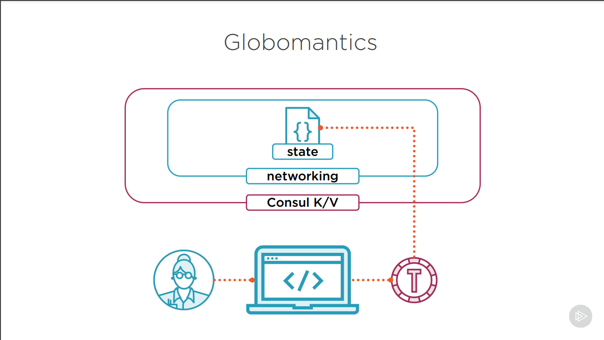

# Terraform - Deep Dive

## Notes

### Intro and Recap

#### Additional Technologies

- **Amazon Web Services** for cloud
- **Docker** for containerization
- **Jenkins** for CI/CD
- **Ansible** for configuration management
- **Consul** for storage of remote state and configuration data

#### Course Content

- Import existing resources
- Data sources and templates
- Managing state data
- Adding a CI/CD pipeline
- Workspaces and collaboration
- Integrate with config managers

### Working with Existing Resources

#### Globomantics Environment

- Using AWS for cloud provider
- Terraform for network deployment
- Network consistency and security
- Tagging per company policies

#### The Import Command

```
# Command syntax
terrafrom import [options] ADDR ID

# ADDR - configuration resource identifier
# Ex. - module.vpc.aws_subnet.public[2]

# ID - provider specific resource identifier
# Ex. - subnet-ad53afg9

# Importing a subnet into a configuration

terraform import -var-file="terraform.tfvars" \
    module.vpc.aws_subnet.public[2] subnet-ad536afg9
```

### Managing State in Terraform

- State data exploration
- Backend options for state data
- Migrating state data

#### Terraform State

- JSON format (Do not touch!)
- Resources mappings and metadata
- Inspect through CLI
- Refreshed during operations
- Stored in backends
    - Standard & enhanced (stores and also runs terraform CLI commands)
    - Locking & workspaces

#### Terraform State Commands

- `list`: lsit objects in state data
- `show`: show details about an object
- `mv`: move an item in state
- `rm`: remove an item from state
- `pull`: output current state to stdout
- `push`: update remote state from local

#### Backends

- State data is stored in backends
- Backends must be initialized
- Parial configurations are recommended
    - If you have credentials for the remote backend it should not be hard
    coded and must be passed at run time
- Interpolation is not supported

##### Backend Example

```hcl
# Basic backend configuration

terraform {
    backend "type" {
        # backend info
        # authentication info
    }
}
```

##### Types of Backends

1. Consul
2. AWS S3 (has to be used with DynamoDB to support locking and workspaces)
3. Azure Storage
4. Google Cloud Storage

#### Consul Access



#### Migrating Terraform State

- Update backend configuration
- Run terraform init
- Confirm state migration

### Using Data Sources and Templates
### Using Workspaces and Collaboration
### Troubleshooting Terraform
### Adding Terraform to a CI/CD Pipeline
### Integrating with Configuration Managers

