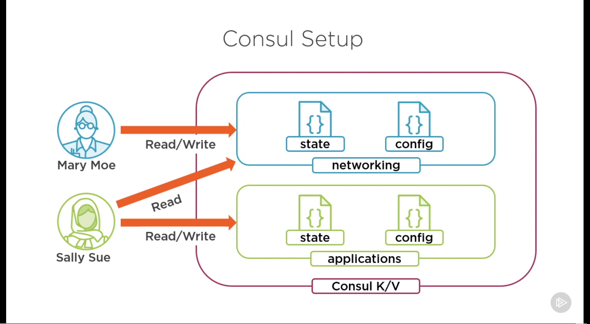

# Terraform - Deep Dive

## Notes

### Intro and Recap

#### Additional Technologies

- **Amazon Web Services** for cloud
- **Docker** for containerization
- **Jenkins** for CI/CD
- **Ansible** for configuration management
- **Consul** for storage of remote state and configuration data

#### Course Content

- Import existing resources
- Data sources and templates
- Managing state data
- Adding a CI/CD pipeline
- Workspaces and collaboration
- Integrate with config managers

### Working with Existing Resources

#### Globomantics Environment

- Using AWS for cloud provider
- Terraform for network deployment
- Network consistency and security
- Tagging per company policies

#### The Import Command

```
# Command syntax
terrafrom import [options] ADDR ID

# ADDR - configuration resource identifier
# Ex. - module.vpc.aws_subnet.public[2]

# ID - provider specific resource identifier
# Ex. - subnet-ad53afg9

# Importing a subnet into a configuration

terraform import -var-file="terraform.tfvars" \
    module.vpc.aws_subnet.public[2] subnet-ad536afg9
```

### Managing State in Terraform

- State data exploration
- Backend options for state data
- Migrating state data

#### Terraform State

- JSON format (Do not touch!)
- Resources mappings and metadata
- Inspect through CLI
- Refreshed during operations
- Stored in backends
    - Standard & enhanced (stores and also runs terraform CLI commands)
    - Locking & workspaces

#### Terraform State Commands

- `list`: lsit objects in state data
- `show`: show details about an object
- `mv`: move an item in state
- `rm`: remove an item from state
- `pull`: output current state to stdout
- `push`: update remote state from local

#### Backends

- State data is stored in backends
- Backends must be initialized
- Parial configurations are recommended
    - If you have credentials for the remote backend it should not be hard
    coded and must be passed at run time
- Interpolation is not supported

##### Backend Example

```hcl
# Basic backend configuration

terraform {
    backend "type" {
        # backend info
        # authentication info
    }
}
```

##### Types of Backends

1. Consul
2. AWS S3 (has to be used with DynamoDB to support locking and workspaces)
3. Azure Storage
4. Google Cloud Storage

#### Consul Access


#### Migrating Terraform State

- Update backend configuration
- Run terraform init
- Confirm state migration

### Using Data Sources and Templates

- Data source types
- Config from external sources
- Templates, templates, templates

#### More Teams, More Problems

- Information Security (Define roles, policies, and groups)
- Software Development (Read network configuration for app deployment)
- Change Management (Store configuration data centrally)

#### Data Sources

- Glue for multiple configurations
- Resources are data sources
- Providers have data sources
- Alternate data sources
    - Template
    - HTTP
    - External (runs a script which has to return a valid json)
    - Consul

##### HTTP Data Source

```
# Example data source
data "http" "my_ip" {
    url = "http://ifconfig.me"
}

# Using the response
data.http.my_ip.body
```

##### Consul Data Source

```
# Consul data source
data "consul_keys" "networking" {
    key {
        name = "vpc_cidr_range"
        path = "networking/config/vpc/cidr_range"
        defualt = "10.0.0.0/16"
    }
}

# Using the resource
data.consul_keys.networking.var.vpc_cidr_range
```

#### Consul Setup



#### Templates

- Manipulation of strings
- Template is an **overloaded term**
    - Quoted strings
    - Heredoc syntax
    - Provider
    - Function
- Interpolation and directives

##### Template Strings

- When you do any interpolation you are basically using a template
- They are expressed in the configuration directly and doesn't require another
file
- You can use heredoc syntax for readability

```hcl
# Simple interpolation
"${var.prefix}-app"

# Conditional directive
"%{ if var.prefix != "" }${var.prefix}-app%{ else }generic-app%{ endif }"

# Collection directive with heredoc
<<EOT
%{ for name in local.names }
${name}-app
%{ endfor }
EOT
```

##### Template Syntax In-line

```hcl
# Template data source
data "template_file" "example" {
    count = "2"
    template = "$${var1}-$${current_count}"
    vars = {
        var1 = var.some_string
        current_count = count.index
    }
}

# Using the template
data.template._file.example.rendered
```

##### Template Syntax File

```hcl
# Template configuration
data "template_file" "peer-role" {
    template = file("peer_policy.txt")
    vars = {
        vpc_arn = vpc.vpc_arn
    }
}

# or

templatefile("peer_policy.txt", {
        vpc_arn = var.vpc_arn 
    }
)
```

```txt
# peer_policy.txt

{
    "Version": "2012-10-17",
    "Statement": [
        {
            "Action": [
                "ec2:AcceptVpcPeeringConnection",
                "ec2:DescribeVpcPeeringConnections"
            ],
            "Effect": "Allow",
            "Resource": [
                "${vpc_arn}"
            ]
        }
    }
}
```

#### Summary

- Templates for code reuse
- Data sources glue configs together
- Custom data sources are an option

### Using Workspaces and Collaboration

- Using workspaces for environments
- Collaborating with remote state
- Use remote state as a data source

#### Globomantics Environment

- Work with the larger team
- Create infrastructure for other teams
- Enable collaboration through remote state

#### State as Data Source

```hcl
data "terraform_remote_state" "networking" {
    backend = "consul"
    config = {
        path = var.network_path
        address = var.consul_address
        scheme = var.consul_scheme
    }
}
```

#### Summary

- Workspaces for environments
- Remote state for collaboration

### Troubleshooting Terraform

- Validating configurations
- Enable verbose logging
- Resource taints
- Crash logs

#### Globomantics Environment

- Application team update
- Troubleshooting deployment issues
- Panic! at the Terraform

##### Application update

We have the public subnet and the private subnet. The webservers are sitting in
a public subnet while the database and its read-only copy are sitting in the
private subnet.

The webserver are not logging their data to a centralized location and we need
to change that, they would like to create an s3 bucket and they want the data 
to be written to that bucket. To achieve this they will need to create an IAM
role and associate it with each instance.

#### Types of Errors

- Command error
    - Happens at the command line
    - Bad CLI syntax or arguments
    - Use the help argument to understand the command or go and read the docs
- Syntax validation
    - It checks both the syntax and the logic
    - Does not check state
    - It can be done manually by using `terraform validate` but it will also
    happen automatically if you use `terraform plan`, `terraform apply`, and
    even when you try and change terraform workspaces
- Provider validation and Deployment error (this is where we get into resource 
taints)
    - Provider validation happens during `terraform plan` and deployment errors
    happen during `terraform apply`
    - Read the error message, then read it again, and then read it again. Some
    times you might go into a rabbit hole and then discover that the error
    message was something else entirely
    - If you cannot find enough details in the error message, enable verbose 
    logging at a level which is appropriate for you to get what you need
    - During deployment sometimes resouces will be created and that were not
    created properly
        - Sometimes terraform knows that and sometimes it doesn't
        - If it doesn't then you can taint the resource manually to force
        creation
- Panic! (Sometimes terraform just breaks, **no application is perfect that
includes terraform**)

#### Verbose Logging

- It exposes the actions terraform is taking
- You can enable it by setting the `TF_LOG` to one of stages mentioned below
- You can also add it to a file by setting `TF_LOG_PATH`
- The stages of logs going from highest verbose to the least are `TRACE`, 
`DEBUG`, `INFO`, `WARN`, `ERROR`. Generally you should set it to `WARN` or 
`INFO`
- Useful in automation

#### Resource Taints

- They are a way to mark a resource for recreation
- Sometimes terraform will taint automatically but if it doesn't then you can
taint resources manually by identifying its address within terraform.
- Resources can also be untainted

##### Taint and Untaint Command

```
# Command syntax
terraform taint [options] address

# Example single resource
terraform taint aws_instance.example

# Example module or collection
terraform taint aws_instance.collection[0]
terraform taint module.asg.aws_instance.example

# Untaint syntax
terraform untaint [options] address

# Example single resource
terraform untaint aws_instance.example
```

#### Crash Log

- Generated when terraform panics
- Caused by Terraform or provider
- Similar to trace logging
- Open an issue on GitHub

#### Summary

- Errors can and will happen
- When you do get an error, read it twice
- When error is not giving you any information go to verbose logging
- Use taints to force recreation of resources but pay attention to the 
lifecycle of those resources so that they are destroyed and created in a proper
order

### Adding Terraform to a CI/CD Pipeline
### Integrating with Configuration Managers

