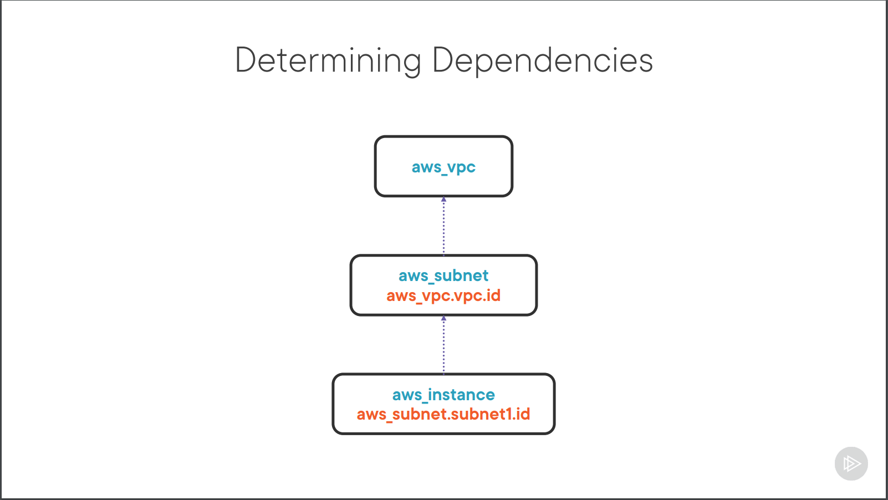
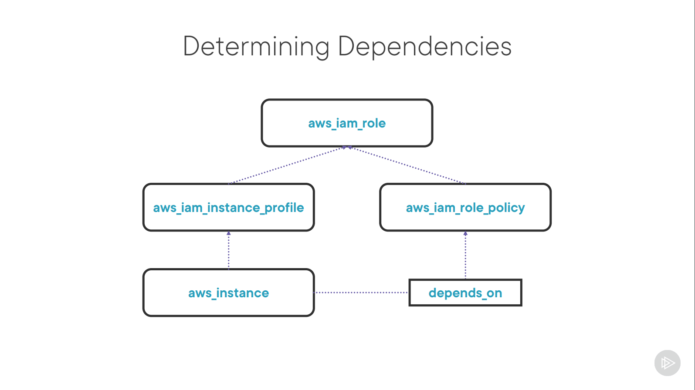

# Terraform - Getting Started

## Notes

### Deploying Your First Terraform Configuration

####  Block Syntax

```tf
block_type "label" "name_label" {
    key = "value"
    nested_block {
        key = "value"
    }
}
```

- **block_type**: Describes type of object

- **label**: Series of labels that are dependent on the type of block we are working
with

- **name_label**: Provides a way to refer back to the object in the rest of the 
configuration

- **key = "value"**: Arguments to the resource

Below is an example for the block syntax

```tf
resource "aws_instance" "web_server" {
    # This name is what we will see in the AWS console
    name = "web-server" 

    ebs_volume {
        size = 40
    }
}
```

#### Terraform Object Reference `<resource_type>.<name_label>.<attribute>`.
For example, `aws_instance.web_server.name`

### Terraform Workflow

#### init
- Terraform init looks for configuration files inside of the current working 
directory and examines them to see if they need any provider plugins.
- If they do, it will try and download those plugins from the public Terraform 
Registry, unless you specify an alternate location.
- Part of the initialization process is getting a state data back end ready. 
If you don't specify a back end, Terraform will create a state data file in the 
current working directory

#### plan
- Terraform will take a look at your current configuration, the contents of 
your state data, determine the differences between the two, and make a plan to 
update your target environment to match the desired configuration. 
- Terraform will print out the plan for you to look at, and you can verify the 
changes Terraform wants to make.
- You can save a plan and feed it as an input to terraform later.

#### apply
- Assuming you ran terraform plan and saved the changes to a file, Terraform 
will simply execute those changes using the provider plugins. The resources 
will be created or modified in the target environment, and then the state data 
will be updated to reflect the changes.
- If we run terraform plan or apply again without making any changes, 
Terraform will tell us no changes are necessary since the configuration and the 
state data match.

#### destroy
- Destroy everything in the target environment

### Deploying the Base Configuration

#### Steps

1. Initialize our configuration
2. Plan the deployment
3. Apply the plan

#### Prerequisites

1. AWS account
2. AWS access keys

### Using Input Variables and Outputs

1. Working with data inside terraform
    1. **Input variables**
    - They are also known as *variables*
    - Values are supplied when terraform is executed


    2. **Local Values**  
    - They are also known as *locals*
    - They are computed values based on internal references and input variables


    3. **Output Values**
    - They are defined in the configuration 
    - The value of each output will depend on what it references inside the 
    configuration
    - Just like locals, the output value can be constructed from one or more 
    elements. 

#### Input variable syntax:

```hcl
variable "name_label" {}
variable "name_label" {
    type = value
    description = "value"
    default = "value"

    # won't show value in logs or terminal output
    sensitive = true | false }
}
```

example:
```
variable "billing_tag" {}

variable "aws_region" {
    type = string
    description = "Region to use for AWS resources"
    default = "us-east-1"
    sensitive = false
}

variable "aws_instance_sizes" {
    type = map(string)
    description = "Instance sizes to use for AWS EC2"
    default = {
        small = "t2.micro"
        medium = "t2.small"
        large = "t2.large"
    }
}
```

#### Terraform variable reference

```
var.<name_label>
```

example:

```
var.aws_region
```

#### [Terraform Data types](https://developer.hashicorp.com/terraform/language/expressions/type-constraints)

    1. Primitive
    - string
    - number
    - boolean

    2. Collection
    - list
    - set
    - map

    3. Structural
    - tuple
    - object

example:

```
# List
[1, 2, 3, 4]
["us-east-1", "us-east-2", "us.west-1", "us-west-2"]
[1, "us-east-2", true] # INVALID LIST

# Map
{
    small = "t2.micro"
    medium = "t2.small"
    large = "t2.large"
}
```

#### Referencing Collection Values

```
# LIST
var.<name_label>[<element_number>]

# MAP 
var.<name_label>.<key_name> 
var.<name_label>["<key_name>"]
```

example:

```
var.aws_regions[0]

var.aws_instance_sizes.small 
var.aws_instance_sizes["small"]
```

#### Locals Syntax

```hcl
locals {
    key = value
}
```

example:

```
locals {
    instance_prefix = "globo"
    common_tags = {
        company = "Globomantics"
        project = var.project
        billing = var.billing_code
    }
}
```

#### Terraform Locals Reference

```
local.<name_label>
```

example:

```
local.instance_prefix
local.common_tags.company
```

#### Output Syntax

```hcl
output "name_label" {
    value = output_value
    description = "Description of output"
    sensitive = true | false
}
```

example: 

```
output "public_dns_hostname" {
    value = aws_instance.web_server.public_dns
    description = "Public DNS hostname web server"
}
```

#### Validating Configuration

    1. `validate` is the command provided by terraform to validate 
    the configuration
    2. You will need to run `init` command before you run the `validate`
    command because it's checking the syntax and arguments of the resources
    in the providers and needs the provider plugins to do so.
    3. When you run `validate`, it will check your syntax and logic to make 
    sure everything looks good
    4. It doesn't check the current state of your deployments it just checks
    the contents of your configuration
    5. It does not guarantee that the updated deployments will be successful. 
    The configuration might be corrent but the deployment can fail for number
    of reasons such as incorrent instance size, overlapping address space,
    insufficient capacity, etc.

#### Supply Variable Values (Ordered in decending order of precedence)
    1. Environment variable (TF_VAR_<NAME>)
    2. terraform.tfvars or terraform.tfvars.json
    3. .auto.tfvars or .auto.tfvars.json
    4. -var-file <name>=<path>
    5. -var <name>=<value>
    6. Command line prompt
    7. Default Value

#### Formatting Configuration (`terraform fmt`)

#### Difference between locals and variables

| Locals | Variables | 
|--------|-----------|
|Local values allow you to define intermediate computed values that can be stored or reuse to make the configuration more readable, concise, and provide a single source of truth |The variables allow you to define dynamic values that can allow customization and flexibility in your Terraform deployments     |
|Locals are like variables in a program|Variables are like input to a program|


### Updating Your Configuration with More Resources

What to do in this section:

- Improving our architecture
- Using the documentation
- Adding resources
- Viewing state data

#### Improvements that can be made
    1. Reduce the single points of failure
        1. Add a second availability zone
        2. Add a second EC2 instance
        3. Add load balancing for instances
    2. Maintain readability of code

#### Additional Data Sources and Resources Required
    ```hcl
    # Data source
    "aws_availability_zones" # List of current availability zones

    # Load balancer resources
    "aws_lb" # AWS Application Load Balancer
    "aws_lb_target_group" # Target group for load balancer
    "aws_lb_listener" # Listener configuration for target group
    "aws_lb_target_group_attachment" # Attach to EC2 instances
    ```

#### State Data
    1. It is stored in a JSON format.
    2. You should not change this state data manually.
    3. When terraform makes any changes state data is locked so conflicts arrive
    
#### State Commands
    ```bash
    # List all state resources
    terraform state list

    # Show a specific resource 
    terraform state show ADDRESS

    # Move an item in state
    terraform state mv SOURCE DESTINATION

    # Remove an item in state
    terraform state rm ADDRESS
    ```

### Adding a New Provider to Your Configuration

What to do in this section:

- Globomantics request
- Understanding providers
- Dependency graphs
- Post deployment configuration

#### Potential Imporvements
    1. Copy website content - Upload files instead of sending user data
    2. Log traffic to an S3 bucket
    3. Use specific provider versions
    4. Properly format files

#### Terraform Providers
    1. There are three types of providers Official, Verified, and Community
    2. They are open source and written in GO
    3. They are versioned using schemantic versioning
    4. You can use multiple instances of the same provider and use aliases to
    refer to them.

#### Terraform Block Syntax
    ```
    terraform {
        required_providers {
            provider_name = {
                source = "address_to_provider"

                # =, <, >, <=, >=, ~> are all valid operators
                version = "version_expression"
            }
        }
    }
    ```

    example:

    ```
    terraform {
        required_providers {
            aws = {
                source = "hashicorp/aws"
                version = "~>3.0"
            }
        }
    }
    ```

#### Provider Block Syntax
    ```
    provider "provider_name" {
        alias = "alias_name"
        # Provider specific arguments
    }
    ```

    example:
    ```
    provider "aws" {
        alias = "west"

        # Provider specific arguments
    }

    resource "aws_instance" "web_server" {
        provider = aws.west

        # Resource specific arguments
    }
    ```

    - If no `provider` argument is specified in **resources** or **data**, Terraform will
    use a default provider that doesn't have an alias. 
    - If there is no default provider Terraform will then throw error `Error: Invalid provider configuration`


#### S3 and IAM Resources
    ```hcl
    # S3 Resource
    "aws_s3_bucket" # S3 bucket itself
    "aws_s3_bucket_object" # Object in the bucket

    # IAM Resources
    "aws_iam_role" # Role for instances
    "aws_iam_role_policy" # Role policy for S3 access
    "aws_iam_instance_profile" # Instance profile

    # Data Source
    "aws_elb_service_account" # For load balanceer access
    ```

#### Planning 
    1. **Refresh and inspect state**
    2. It will parse the configuration and build a **dependency graph** based on
    data sources and resources defined in the code
    3. Comparing the graph to the state data terraform will make a list of
    **addition, updates, and deletions**
    4. Ideally, terraform will try to make the updates in **parallel** by
    figuring out which changes are dependent on other changes. It does this
    with the help of references. Changes that do not have a dependency will
    happen parallelly while the changes that do will happen serially.

#### Determining Dependencies

##### Implicit Dependency


##### Explicit Dependency


#### Post-Configuration Options

1. Resources
    1. If you wanna stay in the terraform eco-system then there are many
    providers and resources to handle your post deployment activities
    2. If you wanna create a file there is a file resource, if you wanna 
    connect to MySQL then there is a MySQL provider.

2. Pass data
    1. Another option to servers is to pass data as a startup script to the 
    server operating system.
    2. All the major cloud provider allows us to pass a script
    3. The downside of passing a script is that you have no way of knowing that
    if the script faied or now.

3. Config managers
    1. There are many config management software that terraform can hand-off to
    for post deployment activities.
    2. Ansible, Puppet, Chef are three well-known examples. 
    3. A common practice is to bake the configuration management software into
    a base image for a machine and have terraform use that base image when it 
    creates an instace

4. Provisioner
    1. Provisioners are defined as part of a resource
    2. They are executed during resource creation and desctruction
    3. A single resource can have multiple provisioners with each provisioner 
    being executed in the order they appear in the configuration.
    4. If you need to run a provisions without a resource, there is a special
    resource called the `null_resources` that allows you
    5. If a provision fails you can tell terraform either fail the entire
    resource action or continue on merrily
    6. Hashicorp considers provisioner as the **LAST RESORT** once every other
    option has been deemed invalid.
    7. Provisioners are not creating objects that Terraform fully understands
    and manage, which puts the onus on you and your team to ensure things like
    error checking, idempotence, and consistency are implemented properly.

#### Types of Provision

1. File
    1. It will create files and directories on remote system.

2. Local-exec
    1. It allows us to run a script on the local machine that is executing the
    Terraform run.
    2. It acts as a placeholder for functionality that may not yet be in the
    provider, and its probably the provisoner that you will see most often.

3. Remote-exec
    1. It allows us to run a script on the remote system.
    2. Normally file provisioner and remote-exec can be replaced with a simple 
    startup script like `user_data` in aws provider.

#### Provisioner Example

```
provisioner "file" {
    connection {
        type = "ssh"
        user = root
        private_key = var.private_key
        host = self.public_ip
    }
}

provisioner "local-exec" {
    command = "local command here"
}

provisioner "remote-exec" {
    connection {
        ...
    }
    command = ["list", "of", "scripts"]
}
```

### Using Functions and Looping in Your Configuration

What to do in this section:

- Globomantics request
- Loops and dynamic blocks
- Using functions
- Terraform console 

#### Potential Improvements (Globomantics request)

- Dynamically increase instances
- Decouple the startup script (by making a template)
- Simplify networking input
    - Allow dynamic allocation of CIDR addresses to the subnets with the
    help of the VPC CIDR
- Add consistent naming prefix

#### Looping Constructs

- count 
- for_each
- dynamic blocks

#### Count Syntax

```
resource "aws_instance" "web_servers" {
    count = 3
    tags = {
        Name = "globo-web-${count.index}"
    }
}
```

#### Count References

```
<resource_type>.<name_label>[element].<attribute>
aws_instance.web_servers[0].name # Single instance
aws_instance.web_servers[*].name # All instances (will return a list of names)
```

#### For_each Syntax

```
resource "aws_s3_bucket_object" "taco_toppings" {
    for_each = {
        cheese = "cheese.png"
        lettuce = "lettuce.png"
    }

    key = each.value
    source = ".${each.value}"
    tags = {
        Name = each.key
    }
}
```

#### For_each References

```
<resource_type>.<name_label>[key].<attribute>
aws_s3_bucket_object.taco_toppings["cheese"].id # Single instance
aws_s3_bucket_object.taco_toppings[*].id # All instances
```

#### Looping Targets

```
# Primary resources
"aws_subnets" # count loop
"aws_instance" # count loop
"aws_s3_bucket_object # for_each loop

# Impacted resources
"aws_route_table_association"
"aws_lb_target_group_attachment"
```

#### Terrform Expressions

- Interpolation and heredoc
- Arithmetic and logical operators
- Conditional Expressions
- For expressions

#### Terraform Functions

- Built-in Terraform
- A signature of a function may look like this`Func_name(arg1, arg2, arg3, ...)`
- Terraform function arguments are not names but positional
- You could test function by placing them in the configuration and running a
plan but that is a bit time consuming and difficult to debug so terraform has
provided us with a console. 
- `terraform console` will also load up all the state data.
- Terraform has over 100 functions.

#### Common Function Categories

- According to the documentation there are 9 function categories with more to
come in the future.

1. Numeric, e.g. min(42, 13, 7)
2. String, e.g. lower("TACOS") 
3. Collection, e.g. merge(map1, map2)
4. IP network, e.g. cidrsubnet
5. Filesystem, e.g. file(path)
6. Type conversion, e.g. toset()

#### Functions to Use

```
# Startup script
templatefile(file_location, { map of variables })

# Extract subnet address from VPC CIDR
cidrsubnet(cidr_range, subnet bits to add, network number)

# Add tags to common tags
merge(common_tags, { map of additional tags })

# S3 bucket name
lower("bucket name")
```
